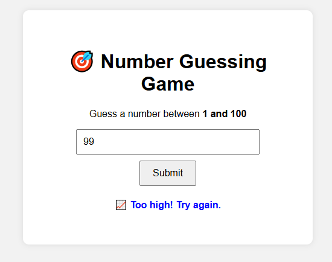

# 🎯 Number Guessing Game

A simple number guessing game built with **HTML**, **CSS**, and **JavaScript**. The goal is to guess a randomly generated number between 1 and 100.

---

## 🚀 Demo

> 📍 Live Preview: [Click here](https://Kalyani-Bambal.github.io/number-guessing-game) *(if GitHub Pages is enabled)*

---

## 📸 Screenshot

 <!-- Optional: Add an actual screenshot image -->

---

## 🧩 Features

- Generates a random number between 1 and 100
- User input validation
- Color-coded result messages
- Simple and clean UI

---

## 🛠️ Tech Stack

- HTML5
- CSS3
- JavaScript (Vanilla)

---

## 📂 Folder Structure

number-guessing-game/
├── index.html # Game layout
├── style.css # Styling
├── script.js # Game logic
└── README.md # Project documentation


---

## 💻 Setup Instructions

1. **Clone the repository**
   ```bash
   git clone https://github.com/Kalyani-Bambal/number-guessing-game.git
   cd number-guessing-game
   ```

2. **Open the Game**
   ```bash
   Just open the index.html file in your browser.
   ```

---

### 🎥 Output Demo

<p align="center">
  
</p>

